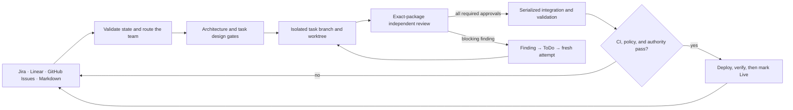

# Startup Factory

### Run a governed team of coding agents from Jira, Linear, GitHub Issues, or Markdown.

Startup Factory coordinates planning, isolated implementation, independent
review, integration, and policy-gated release across the models and tools you
already use. Plans, decisions, evidence, blockers, and delivery state stay
visible in your project board instead of disappearing into agent sessions.

[See the demo](#demo) · [Try it with local Markdown](#quick-start) ·
[See how it differs](#how-it-fits)

**Board-native · Multi-model · Isolated worktrees · Evidence-bound reviews ·
Fail-closed releases**

> **Safe by default:** board automation and production delivery ship disabled.
> Ordinary agents do not receive production credentials, and an exact current
> green CI proof is required before the protected release executor can deploy.

## Demo


## Quick start

Start with one coding agent and the local Markdown tracker. This path needs no
Jira, Linear, or GitHub account and does not start background automation or
production delivery.

> **Release status:** the `uvx` path below becomes the recommended installation
> path when the first `v0.1.0` package is published. Until then, use the source
> installation immediately below it.

### 1. Install into a Git repository

After `v0.1.0` is published:

```bash
uvx startup-factory@latest install --agent codex
```

For Claude Code, use `--agent claude-code`. For Aider, use `--agent aider`.

Before the first package release, use the auditable source installer:

```bash
SF_INSTALL_DIR=.agents/skills/startup-factory
(
  set -eu
  installer="$(mktemp "${TMPDIR:-/tmp}/startup-factory-install.XXXXXX")"
  trap 'rm -f "$installer"' EXIT
  curl -fsSLo "$installer" \
    https://raw.githubusercontent.com/alexrolls/startup-factory/main/bin/update-installed-skill.sh
  bash "$installer" --install-dir "$SF_INSTALL_DIR"
)
```

For Claude Code, set
`SF_INSTALL_DIR=.claude/skills/startup-factory`. The source path requires
`curl`, `git`, and `rsync`.

### 2. Ask your agent to plan a feature

```text
Plan a feature: add CSV export to the reports page.
```

Startup Factory creates a `[feature]` and its `[tasks]` under
`.workspace/task-manager/`. Continue in the same generic vocabulary:

```text
Start task 1.
Send task 1 to review.
Finalize task 1.
```

That is the single-agent loop: plan → start → review → complete. The same
vocabulary works when you later switch trackers or enable a full team.

### 3. Verify the installed runtime

This makes no LLM calls and incurs no model cost:

```bash
bash .agents/skills/startup-factory/tests/run-all.sh
```

A healthy installation ends with `ALL TESTS PASS`.

## What happens after a task enters ToDo



With automation enabled, the deterministic supervisor scans eligible queued
work, ignores tasks labeled `human-work`, and launches only validated routes.
Each implementation attempt receives its own branch and worktree. Review binds
all verdicts to one exact package, integration remains serialized, and release
authority stays in a separate credential-isolated executor.

## Why Startup Factory

| Differentiator | What it changes |
|---|---|
| **The board is the control plane** | Ownership, progress, decisions, evidence, denials, and recovery state survive individual model sessions. |
| **Work and review are evidence-bound** | Every attempt is isolated; required reviewers approve the same exact package rather than a conversational summary. |
| **Agents do not hold release authority** | CI, immutable policy, exact approval, and independent verification gate a separate production executor. Unknown or stale evidence fails closed. |

The system is model-, language-, framework-, tracker-, and cloud-agnostic. Mix
Claude, Codex, Gemini, or another file-reading coding agent by role, and keep
your existing repository, build commands, CI system, and deployment provider.

## How it fits

Startup Factory wraps the tools you already use rather than replacing them.

| Existing layer | Keep using it for | Startup Factory adds |
|---|---|---|
| **Codex, Claude, Gemini, or another coding agent** | Reasoning, implementation, and local verification | Role routing, task-scoped context, lifecycle, isolation, review, and recovery |
| **Jira, Linear, GitHub Issues, or Markdown** | Product state and team visibility | A deterministic delivery queue and durable evidence trail |
| **Git and CI/CD** | Version control, builds, tests, and provider-specific deployment mechanics | Attempt isolation, serialized integration, exact-commit policy, approval, and release gates |
| **Agent skills such as Superpowers** | Planning and task-local engineering methods | Cross-role orchestration, tracker state, independent governance, and production delivery |

## Choose your operating mode

Adopt only the layers you need. All modes use the same `[feature]`, `[task]`,
and status vocabulary.

| Goal | Runtime shape | Start here |
|---|---|---|
| **Give one agent a reliable project workflow** | Your existing agent reads `SKILL.md`; no daemon or external tracker is required. | [Quick start](#quick-start) |
| **Run a governed specialist team** | Gate roles, task workers, isolated worktrees, independent reviews, and one integrator. | [Run a whole team](#run-a-whole-team) |
| **Continuously pull work from the board** | Cron, a service timer, or a hosted scheduler invokes bounded deterministic passes. | [Board automation](#board-automation) |
| **Deliver approved work to production** | A protected executor applies provider-neutral hooks only after all evidence and authority checks pass. | [Production delivery](#production-delivery) |

## Safety model

Startup Factory supplies workflow and release controls; repository code alone is
not an operating-system security boundary. Autonomous operation requires a real
worktree-scoped sandbox and least-privilege identities.

- **Deny, require approval, or allow.** One code-owned policy applies to every
  privileged release action. Project configuration may add denials, never
  remove the built-in baseline.
- **No production credentials in LLM processes.** Only the protected release
  executor receives a separate target-scoped credential environment.
- **Exact evidence, not claimed authority.** Tracker comments and role names are
  workflow evidence, not authentication. Approvals bind commits, artifacts,
  targets, digests, expiry, and one-use nonces.
- **Task-scoped containment.** Implementers work in separate git worktrees;
  integration and terminal transitions are serialized and read back.
- **Human-controlled blocking.** `[Blocked]` fences the affected task while
  independent work continues. Startup Factory never moves a task out of that
  state.
- **Automation is opt-in and fail-closed.** Malformed, incomplete, stale, or
  conflicting state pauses the affected action instead of guessing.

Read the complete boundary before enabling autonomous operation or delivery:
[`reference/guardrails.md`](reference/guardrails.md),
[`reference/automation.md`](reference/automation.md), and
[`reference/deployment.md`](reference/deployment.md).

## Requirements

For the single-agent Markdown workflow:

- a git repository;
- a POSIX shell;
- an agentic CLI or IDE that can read project files;
- `uvx` or `pipx` after the package release, or `curl`, `git`, and `rsync` for
  the source installer.

For a multi-agent team, additionally configure `bash`, git worktrees, role
commands, worktree provisioning, and real validation commands. `tmux` is
optional; without it, agents run as background processes.

Autonomous board operation additionally requires a protected external
installation, a real OS/container sandbox, a broker-only tracker writer, an
external lifecycle-state directory, and a scriptable tracker adapter. Production
delivery requires separate protected hooks, state, approvals, CI evidence, and
credentials.

## Installation and updates

Startup Factory is project-scoped because tracker, team, automation, deployment,
and guardrail configuration belongs to one repository.

| Agent | Project install directory | Discovery |
|---|---|---|
| **Codex** | `.agents/skills/startup-factory` | Native project skill path |
| **Claude Code** | `.claude/skills/startup-factory` | Native project skill path |
| **Aider** | `.agents/skills/startup-factory` | Start with `aider --read .agents/skills/startup-factory/SKILL.md` |
| **Other agents** | Their native project skill directory | Point the agent at `SKILL.md` |

### Release installation

The release package embeds a deterministic bundle built from an exact git
commit. The installer verifies archived paths, modes, sizes, and SHA-256
digests, then records local provenance.

> These commands require the published `v0.1.0` package. Use the source path in
> the [quick start](#quick-start) until that release exists.

```bash
# Codex
uvx startup-factory@latest install --agent codex

# Claude Code
uvx startup-factory@latest install --agent claude-code

# Alternative isolated runner
pipx run startup-factory install --agent codex

# Explicit destination
uvx startup-factory@latest install \
  --install-dir /absolute/path/to/startup-factory
```

Use an exact version such as `startup-factory@0.1.0` in controlled
environments.

### Safe updates and verification

```bash
uvx startup-factory@latest update --agent codex --dry-run
uvx startup-factory@latest update --agent codex
uvx startup-factory@latest verify --agent codex
```

Updates preserve the seven project configuration files and project-owned files
under the documented `adapters/`, `extensions/`, and `teams/` extension points.
Use `--overwrite-config` only when you intentionally want bundled defaults.

Source-managed installations can update with their installed compatibility
script:

```bash
bash .agents/skills/startup-factory/bin/update-installed-skill.sh --dry-run
bash .agents/skills/startup-factory/bin/update-installed-skill.sh
```

Do not run the shell updater over a release-managed installation; use `uvx` or
`pipx` so provenance remains verifiable.

### Remove it

Stop any managed team or scheduler first, then remove the selected project skill
directory shown in the table above. Runtime data under `.workspace/` and
`.teamwork/` is separate and should be preserved unless you intentionally want
to discard project history. Removing the skill directory does not remove that
project data.

## Connect your tracker

Choose one adapter in
[`config/project-management.config.md`](config/project-management.config.md):

```text
PRODUCT_MANAGEMENT_TOOL=Markdown
```

| Tracker | Interactive access | Unattended access |
|---|---|---|
| [`Markdown`](adapters/Markdown.md) | Local files | Local files; no credentials |
| [`Linear`](adapters/Linear.md) | MCP or GraphQL | GraphQL with exact team scope |
| [`Jira`](adapters/Jira.md) | MCP or REST | REST with exact project and child type |
| [`GitHub Issues`](adapters/GitHubIssues.md) | GitHub MCP or `gh` | `gh` with an explicit repository |

The default Markdown root is `.workspace/task-manager`. To add another tracker,
copy [`adapters/_TEMPLATE.md`](adapters/_TEMPLATE.md) and implement the
project-owned primitive backend described in
[`extensions/tracker-backends/README.md`](extensions/tracker-backends/README.md).

## Connect your models

Single-agent mode needs no separate model configuration: install the skill where
your agent discovers it and talk to that agent normally.

For team mode, map each role to any file-reading coding-agent CLI in
[`config/team.config.md`](config/team.config.md):

```text
TEAM_LEAD_CMD="claude -p \"$(cat '{prompt_file}')\" --permission-mode acceptEdits"
PRINCIPAL_ARCHITECT_CMD="claude -p \"$(cat '{prompt_file}')\" --permission-mode acceptEdits"
SCEPTICAL_ARCHITECT_CMD="codex exec --full-auto \"$(cat '{prompt_file}')\""
SENIOR_SECURITY_ENGINEER_CMD="codex exec --full-auto \"$(cat '{prompt_file}')\""
INTEGRATOR_CMD="claude -p \"$(cat '{prompt_file}')\" --permission-mode acceptEdits"
TEAM_DEFAULT_CMD="codex exec --full-auto \"$(cat '{prompt_file}')\""
```

The Team Lead, Principal Architect, Sceptical Principal Architect, and Senior
Security Engineer are mandatory distinct review seats. Use different model
families where practical to reduce correlated review failures.

Also configure `WORKTREE_SETUP` and at least one real `VALIDATE_SCRIPT`,
`VALIDATE_BUILD`, `VALIDATE_TEST`, `VALIDATE_LINT`, or `VALIDATE_FORMAT`
command before relying on team results.

## Use it

### One agent

Speak in the stable generic vocabulary:

- `Plan a feature: …` creates a `[feature]` and its `[tasks]`.
- `Start task ENG-142` claims the work and moves it to `[Active]`.
- `Send it to review` moves the task to `[Review]` and follows the configured
  review workflow.
- `Finalize it` completes only after the required validation and review
  evidence exists.
- `Switch the tracker to Linear` follows the Linear adapter setup.

The shipped external status mapping is `ToDo` → `In Progress` → `In Review` →
`Ready for production`; a verified delivered feature becomes `Live`.

### Run a whole team

Set `TEAM_MODE=true` in
[`config/project-management.config.md`](config/project-management.config.md),
configure the role and validation commands, and add `.teamwork/` and
`.workspace/` to the target repository's root `.gitignore`.

```bash
SF_HOME=.agents/skills/startup-factory

git checkout -b payments-revamp

"$SF_HOME/bin/launch-team.sh" gate-team \
  deep-backend payments-revamp ENG-100

"$SF_HOME/bin/dispatch.sh" payments-revamp ENG-100 --watch
```

The launcher starts persistent supervision and review gates. The dispatcher
claims eligible tasks and launches fresh task-scoped workers. Watch or stop the
managed team with:

```bash
tmux attach -t team-payments-revamp
"$SF_HOME/bin/launch-team.sh" status payments-revamp
"$SF_HOME/bin/launch-team.sh" stop payments-revamp
```

Provision the external `BROKER_LIFECYCLE_ROOT` described in
[`config/team.config.md`](config/team.config.md) before relying on managed
liveness, status, or stop operations. The complete launch, dispatch, review,
integration, recovery, and harness contracts live in
[`reference/orchestration.md`](reference/orchestration.md) and
[`reference/dispatch.md`](reference/dispatch.md).

## Board automation

`bin/pm-agent.py` is a deterministic supervisor despite the filename: it makes
zero LLM calls when the board has nothing eligible to do.

```bash
# Inspect one bounded pass from the protected installation
STARTUP_FACTORY_PROJECT_ROOT=/absolute/target-checkout \
STARTUP_FACTORY_AUTOMATION_CONFIG=/protected/config/automation.json \
  /protected/python/bin/python3 -I -S -E -s \
  /protected/startup-factory/bin/pm-agent.py --once --dry-run

# After the dry run passes, print a credential-free cron entry
STARTUP_FACTORY_PROJECT_ROOT=/absolute/target-checkout \
STARTUP_FACTORY_AUTOMATION_CONFIG=/protected/config/automation.json \
  /protected/python/bin/python3 -I -S -E -s \
  /protected/startup-factory/bin/pm-agent.py --print-cron
```

Do not enable it from an ordinary repository checkout. Autonomous operation
requires the external protected installation, sandbox, lifecycle authority,
tracker scope, and single-writer configuration in
[`reference/automation.md`](reference/automation.md). The shipped automation
configuration is disabled and ignores tasks labeled `human-work`.

When the supervisor observes `[Blocked]`, it fences only that task and preserves
its complete communication snapshot. Independent tasks and features continue.
Only a human may return it to the queue, which triggers a fresh review of all
communication and a new numbered attempt.

## Production delivery

Production delivery is disabled by default. The provider-neutral executor uses
structured `plan`, `apply`, `status`, and `verify` hooks, with optional
`rollback`, `verifyCi`, `verifyDelivery`, and `verifyApproval` hooks.

Before apply, it requires:

- the exact integrated feature commit and a gap-free evidence chain;
- current feature-level product acceptance;
- a current green CI proof for that exact commit;
- policy-clean command and plan manifests;
- the configured approval or delivery attestation;
- trusted code, hook, config, target, and artifact bindings.

The executor queries current target state, applies through the protected
credential environment, independently verifies the deployed version and
health, and only then marks the feature `Live`. Read and test the complete
transaction contract in [`reference/deployment.md`](reference/deployment.md)
before enabling [`config/deployment.config.json`](config/deployment.config.json).

## Optional Superpowers planning

Claude Code can use
[`obra/superpowers`](https://github.com/obra/superpowers) for brainstorming,
specification, implementation planning, TDD, debugging, review response, and
fresh verification.

Startup Factory remains the execution authority: it accepts the committed spec
and plan as challengeable inputs, then owns tracker creation, routing,
worktrees, implementation attempts, independent review, integration, recovery,
and release. This prevents two orchestrators from launching duplicate work.

Set `USE_SUPERPOWERS=false` in
[`config/planning.config.md`](config/planning.config.md) to remove this optional
wiring. The handoff contract is documented in
[`reference/superpowers-planning.md`](reference/superpowers-planning.md).

## Preset teams

| Preset | Best for |
|---|---|
| `full-stack` | Features spanning schema, API, and UI |
| `deep-backend` | Domain logic, data models, APIs, and performance |
| `deep-frontend` | UI architecture, client state, design systems, and accessibility |
| `deep-security` | Security features, hardening, and penetration testing |
| `deep-infra` | Cloud infrastructure, delivery pipelines, and reliability |
| `deep-llm` | RAG, evaluation, inference, LLM security, and AI product UX |

Each preset includes four distinct mandatory review seats plus one serialized
integrator. Optional specialists add evidence but cannot replace required
verdicts. See [`teams/README.md`](teams/README.md) and
[`teams/_PLAYBOOK.md`](teams/_PLAYBOOK.md).

## Documentation

| Read this | It answers… |
|---|---|
| [`SKILL.md`](SKILL.md) | What does the agent load and which invariants govern every workflow? |
| [`reference/vocabulary.md`](reference/vocabulary.md) | What stable feature, task, status, and evidence contract do adapters share? |
| [`reference/lifecycle.md`](reference/lifecycle.md) | How does work move through planning, implementation, review, blocking, and release? |
| [`reference/team-roles.md`](reference/team-roles.md) | Which role owns each team-mode transition? |
| [`reference/orchestration.md`](reference/orchestration.md) | How do roles coordinate, review, integrate, recover, and stop safely? |
| [`reference/dispatch.md`](reference/dispatch.md) | Which deterministic event launches each next action? |
| [`reference/automation.md`](reference/automation.md) | How do protected scans, holds, leases, routing, and recovery work? |
| [`reference/guardrails.md`](reference/guardrails.md) | Which actions are denied, approval-only, or allowed? |
| [`reference/deployment.md`](reference/deployment.md) | How do hooks, approvals, CI evidence, transactions, and rollback work? |
| [`teams/README.md`](teams/README.md) | Which preset should you choose? |

## Extend it

- **New tracker:** copy [`adapters/_TEMPLATE.md`](adapters/_TEMPLATE.md), add a
  project-owned primitive backend under `extensions/tracker-backends/`, and set
  `PRODUCT_MANAGEMENT_TOOL` to the new adapter name.
- **New team:** copy a file under `teams/`, edit its charter and roster, and
  retain the four mandatory review protocol mappings plus the integrator.
- **New role:** add a role brief under `roles/` or `teams/roles/` with identity,
  responsibilities, authority, deliverables, handoffs, and explicit limits.

Extensions keep the generic `[feature]` and `[task]` vocabulary and the existing
protocol markers rather than introducing tracker-specific workflow logic.

## Troubleshooting

| Symptom | Check |
|---|---|
| The agent says the tracker is unavailable | Recheck the selected adapter's access mechanism and exact scope. Startup Factory stops instead of fabricating state. |
| A role will not launch | Confirm its role brief and command mapping exist. The four mandatory review seats must be present, enabled, and distinct. |
| `status` says lifecycle supervision is disabled | Provision the protected external `BROKER_LIFECYCLE_ROOT`; unmanaged PID text is deliberately non-authoritative. |
| An eligible queued task never launches | Check automation enablement, scheduler execution, tracker scope, `human-work`, preset metadata, opt-in metadata, dependencies, and holds. |
| A human returned a Blocked task but no attempt starts | Inspect the resume-review request, communication digest, changed-requirement approvals, and prior worktree cleanliness. |
| Release is awaiting CI | Fix or complete the protected pipeline for the exact release commit. A tracker comment cannot replace CI proof. |
| Release is awaiting authorization | Authorize the exact manifest through the protected approval system before it expires. |
| You want to verify the plumbing | Run `bash tests/run-all.sh`; the suite uses local files and stub agents, with no LLM cost. |

## Credits

Inspired by the
[PlatformPlatform](https://github.com/platformplatform/PlatformPlatform/)
product-management architecture, developed by Thomas Jespersen.

Optional Claude planning builds on
[`obra/superpowers`](https://github.com/obra/superpowers), created by Jesse
Vincent and the Prime Radiant team.

## License

[MIT](LICENSE) · Copyright (c) 2026 ExecMatchAi
